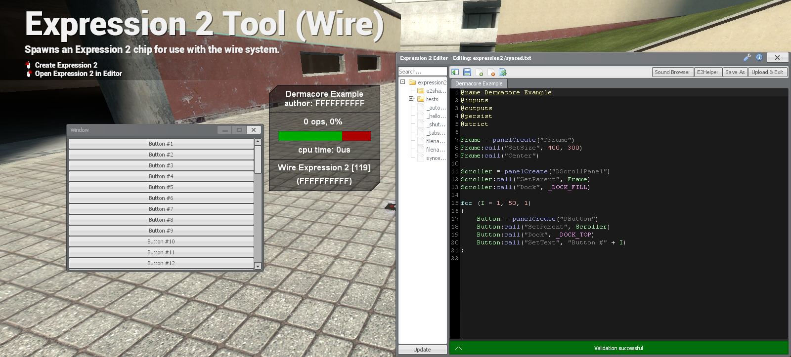

# DermaCore

A core for [Wiremod](https://github.com/wiremod/wire) that allows Expression 2 chips to create VGUI Derma elements.



# Usage

A list of available functions can be found in the E2Helper menu by searching "dermacore" via the "From" input.

<details>

<summary>List of Events</summary>

| Event Name | Arguments | Description |
| :--------- | :-------- | :---------- |
| panelClicked | Panel | Called when a Panel is clicked with the left mouse button |
| panelRightClicked | Panel | Called when a Panel is clicked with the right mouse button |
| panelMiddleClicked | Panel | Called when a Panel is clicked with the middle mouse button (Usually the scroll wheel) |
| panelDoubleClicked | Panel | Called when a Panel is double clicked with the left mouse button. `panelClicked` is still called just before this is. |
| panelDataSync | Panel, String | Called when a Panel receives sync data from the client |

</details>

<details>

<summary>List of Enumerations</summary>

<details>

<summary>Dock</summary>

| Enumeration | Value |
| :--------- | :-------- |
| _DOCK_NONE | 0 |
| _DOCK_FILL | 1 |
| _DOCK_LEFT | 2 |
| _DOCK_RIGHT | 3 |
| _DOCK_TOP | 4 |
| _DOCK_BOTTOM | 5 |

</details>

</details>

If you are unfamiliar with Expression 2 or its syntax, you can learn how to use it at the [Expression 2 Wiki](https://github.com/wiremod/wire/wiki/Expression-2).

If you are unfamiliar with VGUI, Derma, or working with Panels, you can view a list of available elements on the Garry's Mod Wiki [here](https://gmodwiki.com/VGUI_Element_List) and a basic Panel tutorial [here](https://gmodwiki.com/Derma_Basic_Guide).

# Installation

Clone the repository to the `/garrysmod/addons/` folder, the resulting folder will be placed at `/garrysmod/addons/dermacore`.

<details>

```
cd garrysmod/addons/
git clone https://github.com/bjurd/dermacore.git
```

</details>
